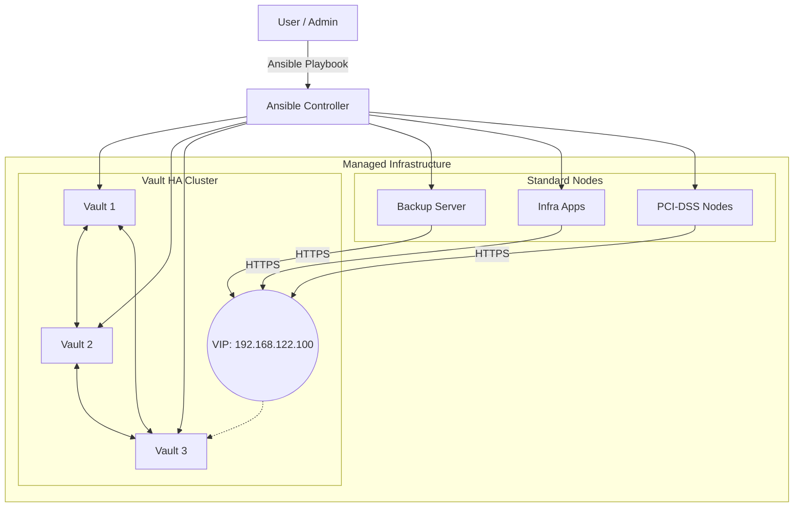

# 금융 서비스 인프라 자동화 (Financial Services Infrastructure Automation)

이 저장소는 금융 서비스 환경을 위해 설계된 **Infrastructure as Code (IaC)** 코드를 포함하고 있으며, 안전하고 고가용성을 갖춘 인프라를 배포하는 것을 목표로 합니다. Ansible Roles 구조를 사용하여 자동화를 구현했으며, HashiCorp Vault를 통한 비밀 관리 및 Keepalived를 이용한 고가용성(High Availability) 구성을 포함합니다.

## 🌟 주요 기능 (Key Features)

- **Ansible Roles 기반 모듈화**: `common`, `vault` 등의 역할을 통해 코드 재사용성과 유지보수성을 극대화했습니다.
- **고가용성 (HA) 보장**: Keepalived VRRP(VIP)와 Vault 헬스 체크를 연동하여 장애 발생 시 리더 선출 및 VIP 페일오버를 자동화합니다.
- **보안 및 규제 준수 (Security & Compliance)**:
  - **PCI-DSS v4.0 & ISMS-P** 기준의 OS 보안 강화(Hardening) 적용.
  - 내부 Root CA 자동 생성 및 전 노드 TLS 신뢰 체계 구축.
  - **SELinux 강화**: Keepalived가 Vault 보안 포트에 접근할 수 있도록 전용 정책 모듈 자동 배포.
- **인프라 통합 관리**: `site.yml` 마스터 플레이북을 통해 모든 서버의 OS 기본 설정, 시간 동기화(NTP/PTP), 보안 강화 및 앱 배포를 한 번에 수행합니다.

## 📋 사전 요구 사항 (Prerequisites)

- **컨트롤 노드 (Control Node)**:
  - Python 3.13 이상 / Ansible (Core)
  - `hvac` 라이브러리 (Vault 연동용)
  - `community.crypto` 컬렉션 (인증서 관리용)
- **타겟 노드 (Target Nodes)**:
  - RHEL 9/10, Rocky Linux 9/10 기반.
  - sudo 권한이 있는 SSH 접근 계정.

## 🚀 시작하기 (Getting Started)

### 1. 환경 설정 (Configuration)

인벤토리와 전역 변수를 사용자의 환경에 맞게 수정하십시오.

- **인벤토리**: `inventory/hosts` 파일에서 노드 그룹을 정의합니다.
- **변수**: `inventory/group_vars/all.yml` 파일에서 IP와 도메인 정보를 설정합니다.

### 2. 전체 인프라 배포 (Full Deployment)

새로운 마스터 플레이북을 통해 전체 구성을 적용합니다.

```bash
# 전체 인프라 (Base + 보안 + Vault HA) 배포
ansible-playbook -i inventory/hosts site.yml
```

## 📂 프로젝트 구조 (Project Structure)

```text
.
├── site.yml                # 마스터 플레이북 (EntryPoint)
├── inventory/              # 인벤토리 및 변수 설정
│   ├── hosts               # 호스트 정의
│   └── group_vars/all.yml  # 인프라 전역 변수 (IP, Domain 등)
├── roles/                  # Ansible Roles
│   ├── common/             # 공통 설정 (Base, NTP, Hardening)
│   └── vault/              # Vault 설치, TLS 인증서, Keepalived 설정
├── certs/                  # 자동 생성된 인증서 (CA, Keys)
├── templates/              # 공통 Jinja2 템플릿
└── legacy_playbooks/       # 백업된 이전 단일 플레이북 파일들
```

## 🏗 시스템 아키텍처 (System Architecture)

다음 다이어그램은 Ansible을 통해 구축되는 인프라의 구성 요소와 연결 관계를 보여줍니다.



## 🛠 주요 수정 사항 (Recent Updates)

- **Vault HA 안정화**: Vault가 봉인(Sealed) 상태일 때도 헬스 체크를 통과하도록 수정하여 관리자가 VIP를 통해 Unseal 작업을 수행할 수 있도록 개선.
- **SELinux 호환성**: Keepalived가 비표준 포트(8202)를 통해 Vault 상태를 체크할 때 발생하는 차단 문제를 해결하기 위해 사용자 정의 SEL인 정책 모듈 추가.
- **Rocky 10 대응**: `audit-rules` 패키지 명시적 설치를 통해 `augenrules` 명령어 오류 해결.